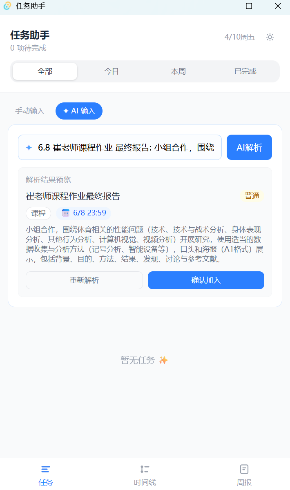
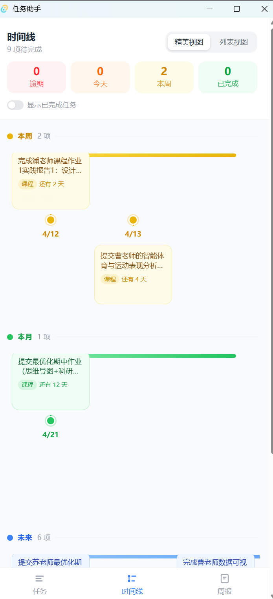
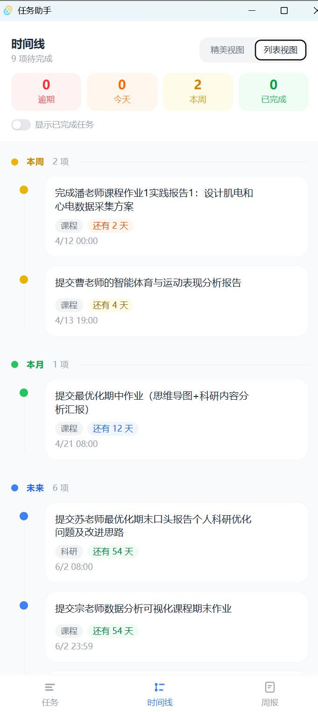
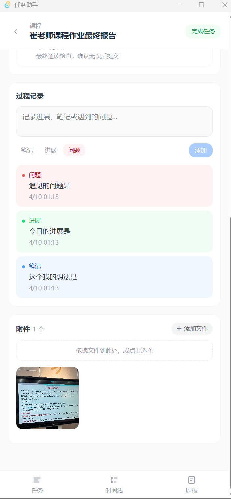
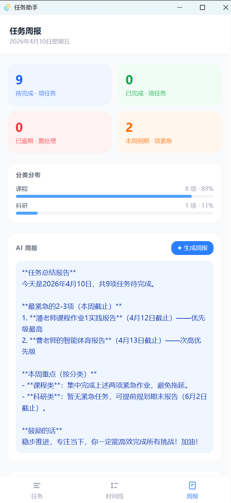

# 任务助手 Task Helper

一个基于 Tauri + React + TypeScript + SQLite 的桌面任务管理应用，聚焦“任务执行过程管理”，不仅能记录待办，还能追踪拆解、进度、问题和附件。

## 项目亮点

### 1. AI 驱动的任务录入与拆解
- 支持自然语言输入任务（例如“下周五提交数据库作业”）。
- 自动解析为结构化字段：标题、分类、截止时间、优先级、备注。
- 一键 AI 拆解任务，生成可执行子任务清单。



### 2. 双模式时间线视图（可视化 + 列表）
- 精美视图：横向时间轴、彩色分组、上下交错节点。
- 列表视图：纵向时间线，适合高密度浏览。
- 支持按紧急度分组（逾期/今天/本周/本月/未来/无截止）。




### 3. 任务详情页（执行过程管理）
- 展示任务核心信息：分类、优先级、截止、备注、创建/完成时间。
- 子任务模块：进度条 + 子任务逐项完成。
- 过程记录模块：笔记/进展/问题三种类型，支持新增与删除。


### 4. 附件系统（图片与文件）
- 支持文件选择与拖拽上传。
- 图片网格预览，支持全屏查看。
- PDF/文档按列表展示，支持系统默认程序打开。
- 附件与任务绑定并持久化存储。



### 5. 每周任务报告
- 周报页展示待办、已完成、逾期、本周到期统计。
- 提供分类分布与全量任务列表。
- 支持 AI 生成任务总结与优先级建议。



### 6. 桌面级体验
- 系统托盘常驻：关闭窗口后最小化到托盘而非退出。
- 开机自启开关：在设置页一键启用/关闭。
- 可打包为独立安装包（无需 Node/Rust 运行环境）。


## 技术栈
- 前端：React 19 + TypeScript + Tailwind CSS + React Router
- 桌面容器：Tauri 2
- 数据库：SQLite（本地持久化）
- AI：DeepSeek API
- 后端（Rust）：任务/子任务/日志/附件命令，系统托盘与自启控制

## 本地开发

### 环境要求
- Node.js 18+
- Rust 1.70+

### 启动开发
```bash
npm install
npm run tauri dev
```

## 打包发布

```bash
npm run tauri build
```

生成产物默认在：

```text
src-tauri/target/release/bundle/
```

Windows 常用安装包位置：

```text
src-tauri/target/release/bundle/nsis/task-helper_1.0.0_x64-setup.exe
```

## AI 配置
- 在应用设置页填写 DeepSeek API Key。
- 获取地址：https://platform.deepseek.com

## 数据存储与隐私
- 所有业务数据默认存储在用户本地（SQLite + 本地配置文件）。
- API Key 不写入仓库源码，不会随 Git 提交上传。

常见路径：
- Windows：`%AppData%\task-helper\`
- macOS：`~/Library/Application Support/task-helper/`

## 目录概览

```text
src/
	components/
	pages/
src-tauri/
	src/
```

## 截图占位说明
- 本 README 中所有 `docs/images/*-placeholder.png` 为图片预留路径。
- 你后续上传真实截图后，保持同名即可自动替换展示。
